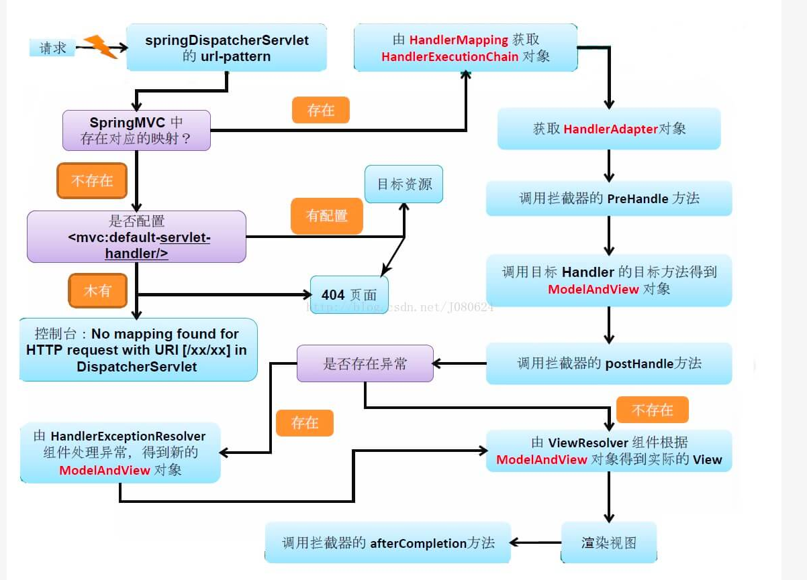

#  SpringMvc源码解析

## SpringMvc九大核心组件 
在前后端分离的情况下,最重要的组件是HandlerMapping + HandlerAdapter + HandlerExceptionResolver

1. MultipartResolver(内容类型(Content-type:multipart)的请求解析器接口)
```
public interface MultipartResolver {
    
    /**
    *  是否为multipart请求
    */
    boolean isMultipart(HttpServletRequest request);
    
    /**
    *  将HttpServletRequest转化为MultipartHttpServletRequest
    */
    MultipartHttpServletRequest resolveMultipart(HttpServletRequest request) throws MultipartException;
    
    /**
    *  清除处理multipart产生的资源 比如资源文件
    */
    void cleanupMultipart(MultiHttpServletRequest request);
}
```

2. LocaleResolver(本地(国际化)解析器接口))
```
public interface LocaleResolver {

    /**
    *  从请求中解析出要用的语言. 比如请求头中的"Accept-Language"
    */
    Locale resolveLocale(HttpServletRequest request);
    
    /**
    * 设置请求所使用的语言
    */
    void setLocale(HttpServletRequest request, @Nullable HttpServletResponse response, @Nullable Locale locale);
}
```

3.ThemeResolver(主体解析器接口)
```
public interface ThemeResolver {

    /**
    *  从请求中解析出使用的主题,从请求头中的"User-Agent"判断使用的是PC端还是手机端
    */
    String resolveThemeName(HttpServletRequest request);
    
    /**
    *  设置请求所使用的主题
    */
    void setThemeName(HttpServletRequest request, @Nullable HttpServletResponse response, @Nullable String themeName);
}
```

4.HandlerMapping(处理器匹配接口,根据请求获得其处理器(handler)和拦截器(HandlerInterceptor数组))

```
public interface HandlerMapping {

    String BEST_MATCHING_HANDLER_ATTRIBUTE = HandlerMapping.class.getName() + ".bestMatchingHandler";
    
    String LOOKUP_PATH = HandlerMapping.class.getName() + ".lookupPath";
    
    String PATH_WITHIN_HANDLER_MAPPING_ATTRIBUTE = HandlerMapping.class.getName() + ".pathWithinHandlerMapping";
    
    String BEST_MATCHING_PATTERN_ATTRIBUTE = HandlerMapping.class.getName() + ".bestMatchingPattern";
    
    String INTROSPECT_TYPE_LEVEL_MAPPING = HandlerMapping.class.getName() + ".introspectTypeLevelMapping";
    
    String URI_TEMPLATE_VARIABLES_ATTRIBUTE = HandlerMapping.class.getName() + ".uriTemplateVariables";
    
    String MATRIX_VARIABLES_ATTRIBUTE = HandlerMapping.class.getName() + ".matrixVariables";
    
    String PRODUCIBLE_MEDIA_TYPES_ATTRIBUTE = HandlerMapping.class.getName() + ".producibleMediaTypes";
    
    @Nullable
    HandlerExcutionChain getHandler(HttpServletRequest request) throws Exception;
}
```

5.HandlerAdapter(处理器适配器接口)
```
public interface HandlerAdapter {
    
    /**
    *  是否支持该处理器
    */
    boolean supports(Object handler);
    
    /**
    * 执行处理器 返回ModelAndView结果
    */ 
    @Nullable
    ModelAndView handle(HttpServletReqeust request, HttpServletResponse response, Object handler) throws Exception;
    
    /**
    * 返回请求的最新更新时间 如果不支持此操作 则返回-1
    */
    long getLastModified(HttpServletRequest request, Object handler);
    
}
```

6.HandlerExceptionResolver(处理器异常解析接口,将处理器执行时的异常转换为对应的结果)
```
public interface HandlerExceptionResolver {
    
    @Nullable
    ModelAndView resolveException(HttpServletRequest request, HttpServletResponse response, @Nullable Object handler, Exception ex);
}
```

7.RequestToViewNameTranslator(请求到视图名的转换器接口)
```
public interface RequestToViewNameTranslator {
    
    /**
    * 请求到视图名的转换接口
    */ 
    @Nullable 
    String getViewName(HttpServletRequest request) throws Exception;
}
```

8.ViewResolver(实体解析接口, 根据视图名和本地化获取最终的View对象)
```
public interface ViewResolver {
    
    /**
    * 根据视图名和本地化获得最终的View对象
    */
    @Nullable
    View resoleViewName(String viewName, Locale locale) throws Exception;
}
```

9.FlashMapManager(FlashMap管理接口, 负责重定向, 保存参数到临时存储中)
```
public interface FlashMapManager {
    
    /**
    * 恢复参数 并将恢复过的和超时的参数从保存介质中删去
    */ 
    @Nullable 
    FlashMap retrieveAndUpdate(HttpServletRequest request, HttpServletResponse response);
    
    /**
    * 将参数保存起来
    */ 
    void saveOutputFlashMap(FlashMap flashMap, HttpServletRequest request, HttpServletResponse response);
    
}
```

## springMvc处理流程
# 

